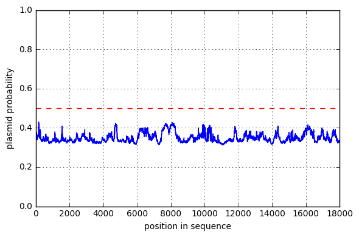
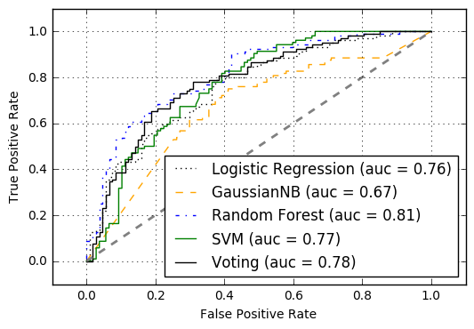

# plasmidminer

detection of plasmid fragments in metagenomic samples

# draft manuscript
https://www.overleaf.com/7758191crzmzwwcxftk


## prediction of multiple sequences from FASTA file

```
usage: predict.py [-h] [-i INPUT] [-m MODEL] [-s] [-p] [--version]

optional arguments:
  -h, --help            show this help message and exit
  -i INPUT, --input INPUT
                        Path to input FASTA file
  -m MODEL, --model MODEL
                        Path to model (.pkl)
  -s, --split           split data based on prediction
  -p, --probability     add probability information to fasta header
  --version             show program's version number and exit
```

i.e. to split input.fasta bases on plasmid prediction use:

```
python plasmidminer/predict.py --input input.fasta --model model.pkl --split --probability
```

if the `--split` command is added, this will create two fasta files `input.fasta.plasmids` and `input.fasta.chromosomes`

## prediction of plasmid probablility within a genome

you can use the sliding window approach `python plasmidminer/predict.py --sliding --window 200 -i input.fasta` to generate the plasmid probability plot for a input FASTA file



## generation of datasets

this script downloads the train/test dataset from ncbi and creates various models

```
usage: plasmidminer.py [-h] [-t TAXA] [-a PLANUM] [-b CHRNUM] [-c CHUNKSIZE]
                       [-e EMAIL] [--version]

optional arguments:
  -h, --help            show this help message and exit
  -t TAXA, --taxa TAXA  Taxonomic name for downloaded samples
  -a PLANUM, --planum PLANUM
                        Number of plasmids to be downloaded
  -b CHRNUM, --chrnum CHRNUM
                        Number of chromosomes to be downloaded
  -c CHUNKSIZE, --chunksize CHUNKSIZE
                        Chunk size in nt
  -e EMAIL, --email EMAIL
                        Email adress needed for ncbi file download
  --version             show program's version number and exit

```


## train
`train.py` will optimize hyperparameters and output the best model fittet on a random subset with the size `--random_size` of the data. During the optimization process it will use roc_auc as validation using cross validation specified using `--iterations` and `--cv`. The best model for each classifier will be saved to `cv/` folder with the model accuracy e.g. `cv/rvc_0.654237288136.pkl` is the model with accuracy of 65%.



```
usage: train.py [-h] [-t TEST_SIZE] [-r RANDOM_SIZE] [-i ITER] [-c CV] [--lhs]
                [--roc] [--balance] [--version]

optional arguments:
  -h, --help            show this help message and exit
  -t TEST_SIZE, --test_size TEST_SIZE
                        size of test set from whole dataset in percent
  -r RANDOM_SIZE, --random_size RANDOM_SIZE
                        size of balanced random subset of data in percent
  -i ITER, --iterations ITER
                        number of random iterations or hyperparameter
                        optimization
  -c CV, --cv CV        cross validation size (e.g. 10 for 10-fold cross
                        validation)
  --roc                 plot ROC curve
  --balance             balance dataset
  --version             show program's version number and exit

```

## install
you may want use virtualenv:

`virtualenv env`
`source env/bin/activate`

to install plasmidminer just type: `python setup.py install`

tested with python 2.7.12


`sudo apt-get install libmysqlclient-dev libpq-dev libboost-all-dev`

### train
`python plasmidminer/plasmidminer`

